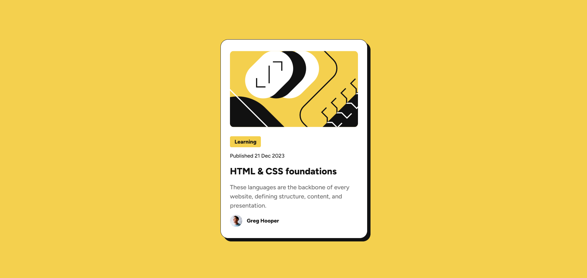

# Blog Preview Card

A solution to the [Frontend Mentor Blog Preview Card challenge](https://www.frontendmentor.io/solutions/html-and-css-blog-preview-card-with-custom-css-styling-jUThY499Wh).

## Screenshot

## Built with

- Semantic HTML5
- Vanilla CSS (Flexbox)

## What I learned

This one was harder than it looked. Getting the spacing and card layout to match the design took a lot of trial and error with flexbox, but I got it done using pure vanilla CSS, no frameworks.

## Author

- Website - [musta.dev](https://musta.dev)
- GitHub - [@mustadotdev](https://github.com/mustadotdev)
- Frontend Mentor - [@mustadotdev](https://www.frontendmentor.io/profile/mustadotdev)
